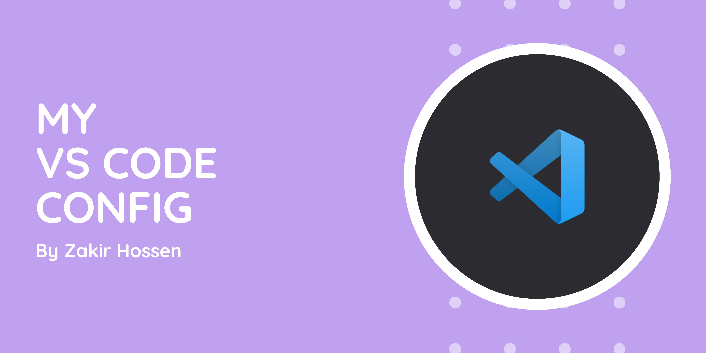

# 👨‍💻 My VS Code Configuration
In this file, I have listed what themes, plugins and font I use in my VS Code editor. I have attached my VS Code json configuration file as well. Hope you will like it. Please star the repository. Thanks ♥

## Table of Contents 💻
- [Themes](#themes-i-use)
- [Plugins](#plugins-i-use)
- [Fonts](#fonts-i-use)
- [Json Config](#vs-code-json-config)

## Themes I use 🌈
- [Ayu by teabyii](https://marketplace.visualstudio.com/items?itemName=teabyii.ayu)
- [One Dark Pro by binaryify](https://marketplace.visualstudio.com/items?itemName=zhuangtongfa.Material-theme)

## Plugins I use ⚙
- [Auto Close Tag](https://marketplace.visualstudio.com/items?itemName=formulahendry.auto-close-tag)
- [Auto Rename Tag](https://marketplace.visualstudio.com/items?itemName=formulahendry.auto-rename-tag)
- [Beautify](https://marketplace.visualstudio.com/items?itemName=HookyQR.beautify)
- [Bracket Pair Colorizer](https://marketplace.visualstudio.com/items?itemName=CoenraadS.bracket-pair-colorizer)
- [Color Highlight](https://marketplace.visualstudio.com/items?itemName=naumovs.color-highlight)
- [Docker](https://marketplace.visualstudio.com/items?itemName=ms-azuretools.vscode-docker)
- [Git History](https://marketplace.visualstudio.com/items?itemName=donjayamanne.githistory)
- [Highlight Matching Tag](https://marketplace.visualstudio.com/items?itemName=vincaslt.highlight-matching-tag)
- [HTML CSS Support](https://marketplace.visualstudio.com/items?itemName=ecmel.vscode-html-css)
- [JavaScript (ES6) code snippets](https://marketplace.visualstudio.com/items?itemName=xabikos.JavaScriptSnippets)
- [Laravel Blade Snippets](https://marketplace.visualstudio.com/items?itemName=onecentlin.laravel-blade)
- [Laravel Extension Pack](https://marketplace.visualstudio.com/items?itemName=onecentlin.laravel-extension-pack)
- [Live Server](https://marketplace.visualstudio.com/items?itemName=ritwickdey.LiveServer)
- [Markdown Preview Enhanced](https://marketplace.visualstudio.com/items?itemName=shd101wyy.markdown-preview-enhanced)
- [Path Intellisense](https://marketplace.visualstudio.com/items?itemName=christian-kohler.path-intellisense)
- [PHP Debug](https://marketplace.visualstudio.com/items?itemName=felixfbecker.php-debug)
- [PHP Intelephense](https://marketplace.visualstudio.com/items?itemName=bmewburn.vscode-intelephense-client)
- [Code formatter](https://marketplace.visualstudio.com/items?itemName=esbenp.prettier-vscode)
- [Vetur](https://marketplace.visualstudio.com/items?itemName=octref.vetur)

## Fonts I use 😎
- [Fira Code by @tonsky](https://github.com/devzakir/fira-code)

## VS Code Json Config 🛠
```json
{
    "workbench.iconTheme": "ayu",
    "editor.wordWrap": "on",
    "php.validate.run": "onType",
    "php.suggest.basic": true,
    "editor.matchBrackets": "always",
    "bracketPairColorizer.highlightActiveScope": true,
    "bracketPairColorizer.showBracketsInGutter": true,
    "bracketPairColorizer.showVerticalScopeLine": false,
    "bracketPairColorizer.activeScopeCSS": [
        "borderStyle : none",
        "backgroundColor : {color}; opacity: 0.5"
    ],
    "diffEditor.ignoreTrimWhitespace": false,
    "editor.minimap.enabled": true,
    "explorer.confirmDelete": false,
    "explorer.confirmDragAndDrop": false,
    "workbench.startupEditor": "newUntitledFile",
    "editor.detectIndentation": false,
    "vetur.format.options.tabSize": 4,
    "files.insertFinalNewline": true,
    "editor.fontFamily": "Fira Code",
    "editor.fontLigatures": true,
    "editor.fontWeight": "400",
    "editor.fontSize": 16,
    "liveSassCompile.settings.formats": [
        {
            "format": "expanded",
            "extensionName": ".css",
            "savePath": "/assets/css"
        }
    ],
    "vetur.format.defaultFormatter.css": "none",
    "vetur.format.defaultFormatter.html": "none",
    "vetur.format.defaultFormatter.js": "none",
    "vetur.format.defaultFormatter.less": "none",
    "vetur.format.defaultFormatter.postcss": "none",
    "vetur.format.defaultFormatter.pug": "none",
    "vetur.format.defaultFormatter.scss": "none",
    "vetur.format.defaultFormatter.ts": "none",
    "liveServer.settings.donotShowInfoMsg": true,
    "terminal.integrated.shell.windows": "C:\\Program Files\\Git\\bin\\bash.exe",
    "editor.accessibilitySupport": "off",
    "editor.formatOnSave": true,
    "git.enabled": false,
    "workbench.colorTheme": "Ayu Mirage Bordered"
}

```
